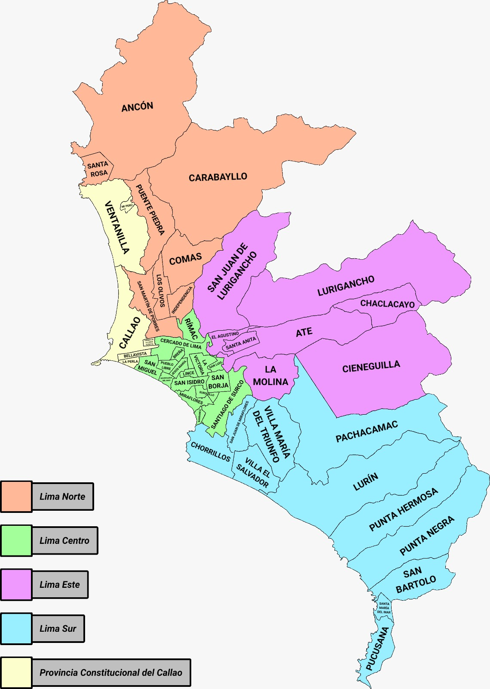
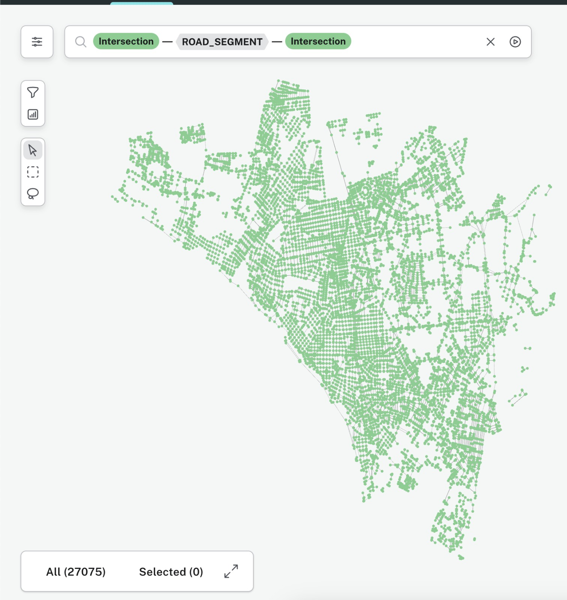
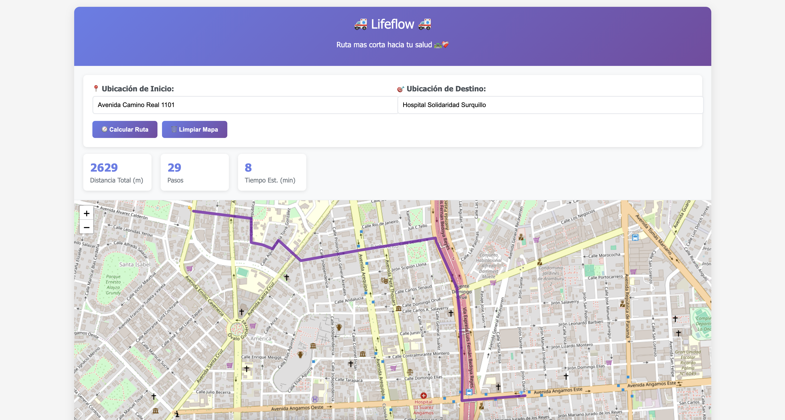

# Lifeflow: Sistema de rutas eficientes para ambulancias 🚑

## 🎯 Objetivo
El objetivo de esta propuesta es diseñar e implementar un sistema inteligente de optimización dinámica de rutas para ambulancias en Lima Centro, con el fin de minimizar el tiempo de respuesta ante emergencias médicas. LifeFlow buscará ofrecer rutas alternativas eficientes en función de la red vial y el estado dinámico de la ciudad, reduciendo así los riesgos de complicaciones médicas por demoras en la atención, y promoviendo un uso más efectivo de los recursos sanitarios.


## 📊 Preprocesamiento
El `notebooks/Neo4j_Street_Maps.ipynb` contiene el preprocesamiento de la base de datos de Neo4j, que se encarga de importar los datos de OpenStreetMap y crear la base de datos de Neo4j.

>[!NOTE]
> Para esta implementacion hemos tomado los distritos de Lima Centro, los cuales son: San Borja, Surquillo, San Isidro, Surco, Miraflores, Rímac, Cercado de Lima, La Victoria, Breña, San Miguel, Pueblo Libre, Jesús María, Lince, Magdalena del Mar, San Luis, Barranco.

### Mapa Lima Metropolitana


### Ingestacion en Neo4j


## ⚙️ Servidor (Backend)
El servidor se encuentra en el archivo `server/main.py` y se encarga de manejar las peticiones del frontend y la base de datos de Neo4j.

Instalar dependencias: 
```sh
cd server
pip install -r requirements.txt
```

Correr el servidor: 
```sh
python server.py
```
Estara corriendo en `http://0.0.0.0:8082`

### Endpoints
- `GET /change-lanes` : Sortea los conductores en frente y elige el de mejor nivel conduccion
- `POST /shortest-path`: Brinda la ruta mas corta utilizando el algoritmo A*, con detalles
- `POST /shortest-path-roads`: Brinda la ruta mas corta utilizando el algoritmo A*, detallando solo el nombre de las calles por la cual navegar
- `GET /find-similar-address`: Busca direcciones similares a la proporcionada


## 🌺 Frontend
### Leaflet para mostrar la ruta en el mapa


### Three JS para realizar la animación de la ruta y dinamica del proyecto
Preview


## Algoritmos Utilizados (Vistos en clase)
- A*: Para obtener el camino mas corto
- Backtracking: Para seleccionar al conductor con mejor nivel de conduccion
- Divide y Vencerás: Para buscar direcciones similares a la proporcionada dentro de la base de datos
- Hash Map: Para mapear las direcciones de los hospitales, el nombre del hospital con su respectiva direccion

## 🤓 Recursos adicionales
- [Comandos CYPHER de Neo4j para la base de datos de LifeFlow 🚑](data/commands_neo4j.md)
- [Endpoints de Nominatim API, para obtener datos de OpenStreetMap 🗺️](data/nominatim_api.md)
- [Clinicas con sus respectivas direcciones o las mas similares a las presentes en la bbdd Neo4j](data/clinicas.json)
- [Datos de conductores con los datos necesarios para la implementacion](data/placas_carros.csv)